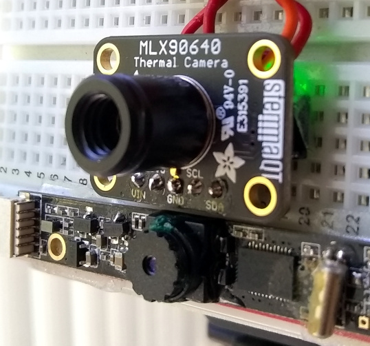
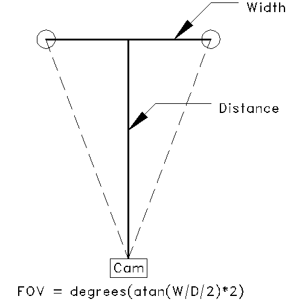

# ThermalCamera


MLX90640 Thermal Camera with Edge Detect Video Overlay, for Raspberry Pi

The Thermal Camera resolution is 32x24, scaled to match the Video Camera resolution.  Running the Video Camera at high resolutions lowers the framerate due to the Laplacian Edge Detect processing:


## Hardware
- Raspberry Pi
- [Adafruit MLX90640 IR Thermal Camera Breakout](https://www.adafruit.com/product/4407)
- USB Camera (see below)


### Cameras

The cameras need to be mounted flat and as close together as possible:



The USB camera pictured is 
["Bare USB Webcam" from Public Lab](https://publiclab.myshopify.com/collections/bits-bobs/products/webcam-dsk-3-0) which unfortunately is no longer available. 

These will probably work, but with a different FOV:
- [Arducam OV5648](https://www.arducam.com/product/arducam-ov5648-auto-focus-usb-camera-ub0238-6/)

- [Newcamermoudle 5MP CMOS Sensor](https://newcameramodule.com/product/small-size-5mp-cmos-sensor-usb-2-0-camera-module/)

By default the camera device is `/dev/video0`.  To change it, edit `videoDev` in `config.ini`:

```
videoDev = /dev/video0
```
---

## Setup


### Installation

The installation script installs:
- pygame
- colour
- MLX90640
- wiringPi

```
cd /home/pi
git clone https://github.com/obstruse/ThermalCamera.git
sudo ThermalCamera/install/installThermalCamera.sh
```
### I2C Baudrate

Increase the I2C baudrate to 1 MHz by editing `/boot/config.txt`.
Modify the **dtparam=i2c_arm=on** line to read:

```
dtparam=i2c_arm=on,i2c_arm_baudrate=1000000
```
...and reboot.

### Configuration

Program settings can be changed by modifying `config.ini` located in the same directory as `heat.py`

&nbsp;|Configuration Settings|&nbsp;
-|-|-
**Key**|**Description**|**Default**
width | display width | 320
height | display height | 240
videoDev | video device | /dev/video0
camFOV | camera FOV | 35
heatFOV | heat FOV | 40
theme | color mapping theme | 1 (0-3 available)
offsetX | image offset X | 0
offsetY | image offset Y | 0
---


## Execution

Run the program from the command line:
```
/home/pi/ThermalCamera/python/heat.py
```

You can run the program remotely from an SSH connection, with the heat displayed in an X-window.  Framerate will drop (see timings above)

Click on the window to bring up the menu overlay:


Commands|&nbsp;
-|-
MAX/+/- | changes the maximum threshold for red pixels. 
MIN/+/- | changes the minimum threshold for blue pixels.
Capture | copy the current camra image to /home/pi/Pictures
Mode    | cycle through the display modes
Back    | return to display
Exit    | exit program


Display Modes:
- heat + camera overlay
- heat + edge detect overlay
- heat only (no scaling)
- camera only (no scaling)

The __Capture__ only saves a single image.  To capture series of images over a period of time, use the gpio command to set GPIO5.  For example, to capture 3 seconds of images, this command:

```
pi@rpi4:~ $ gpio -g write 5 1; sleep 3; gpio -g write 5 0
```
The captured images in /home/pi/Pictures can be combined into an MP4 or GIF using ffmpeg and convert, for example:
```
#!
PATTERN=${1}
convert -delay 8 -coalesce -duplicate 1,-2-1 -layers Optimize -loop 0 ${PATTERN}\*.jpg ${PATTERN}.gif
```
---

## Alignment


### Field Of View (FOV)

The script needs the FOV of both cameras in order to scale the images properly.  The camera data sheet might have a value for FOV, but it's often missing or incorrect.  

To measure the FOV, use the *heat only* and *camera only* modes of `heat.py`.  Separate two objects horizontally until they are at the edges of the image.  Measure the distance between the objects and the distance to the camera to calculate the FOV:

__FOV = degrees(atan(width/distance/2)*2)__



Enter the values for `camFOV` and `heatFOV` in `config.ini`:

```
camFOV = 35
heatfov = 40
```

### Offset

If you carefully mounted the two cameras, the two images should line up fairly well... but then there's the parallax caused by the distance between them.  

To correct for mounting errors and parallax, use the keyboard arrow keys to offset the images until they line up.  Press 'w' to save the offsets in the `config.ini` file

---
---


Thermal Camera with LCD Touchscreen


EICO 460 Oscilloscope chassis hot spots