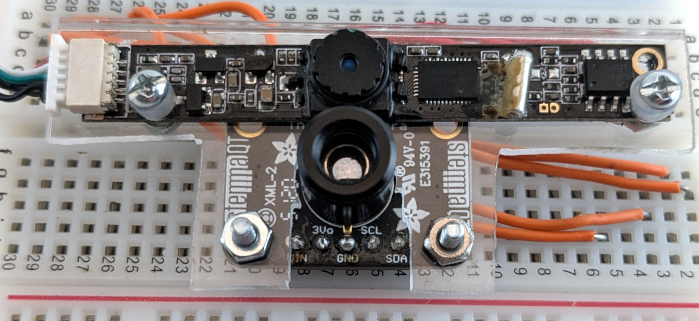
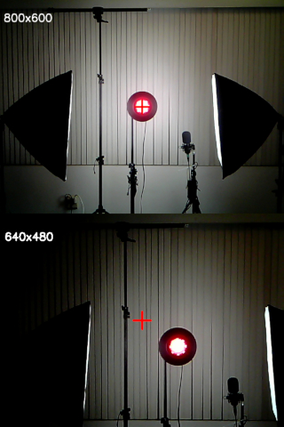
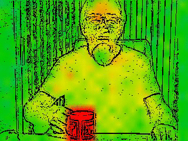
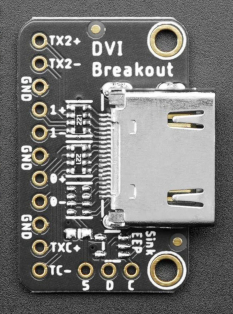
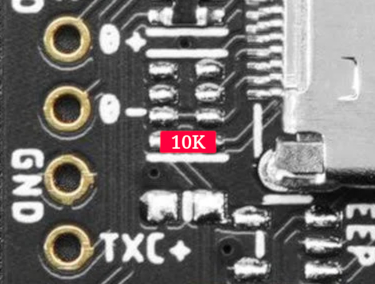
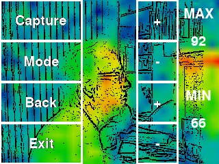
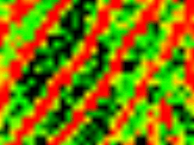
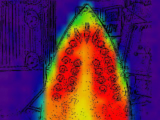
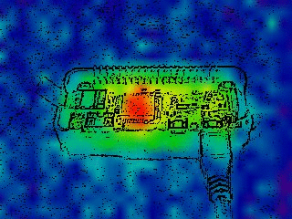

# ThermalCamera


MLX90640 Thermal Camera with Edge Detect Video Overlay.

### Updates:

- Enhanced MLX90640 driver with no wait states.

- Eliminated the 'Too many retries' error:  Refresh Rate no longer dependant on I2C Transfer Speed.

- MLX90640 can either be connected to the I2C pins on a Raspberry Pi, or connected via the HDMI DDC pins on any computer running Linux.

- Bluetooth shutter release used to trigger image/stream capture to file.

The MLX90640 can be set for 64Hz refresh rate (32 fps), but you probably don't want to -- at the higher refresh rates the output is mostly thermal noise:


## Hardware
- Raspberry Pi
- [Adafruit MLX90640 IR Thermal Camera Breakout](https://www.adafruit.com/product/4407)
- USB Camera (see below)


### Cameras

The cameras need to be mounted flat and as close together as possible:



The USB camera pictured is 
["Bare USB Webcam" from Public Lab](https://publiclab.myshopify.com/collections/bits-bobs/products/webcam-dsk-3-0) (no longer available). 

These will probably work (untested):

- [Ultra Tiny USB Webcam Camera with GC0307 Sensor](https://www.adafruit.com/product/5733) (it's only $7)
- [Arducam OV5648](https://www.arducam.com/product/arducam-ov5648-auto-focus-usb-camera-ub0238-6/)

- [Newcamermoudle 5MP CMOS Sensor](https://newcameramodule.com/product/small-size-5mp-cmos-sensor-usb-2-0-camera-module/)

By default the camera device is `/dev/video0`.  To change it, edit `videoDev` in `config.ini`:

```
videoDev = /dev/video0
```
---

Camera Resolution|
-|

Generally, if the final output is 640x480, the camera resolution should be that as well.  Unfortunately, some cameras don't handle the resolution scaling very well.  The camera I'm using for example, has a basic resolution of 800x600.  At that resolution it uses the full sensor and the center of the image (the red '+') aligns with the center of the lens (the circle):



Changing the resolution to 640x480 however,  doesn't rescale the image to the new resolution. Instead it cuts a 640x480 region starting at the top left of the sensor.  The result is an image shifted up and to the left, with a 20% narrower field of view.  Makes it difficult to pair with the heat image.

The solution for this camera was to capture at 800x600, then let the program scale to the final size.  You may need to try different resolutions to get the best fit to the heat image.


## Setup


### Installation

The installation script installs:
- pygame
- colour
- MLX90640
- numpy

```
git clone https://github.com/obstruse/ThermalCamera.git
sudo ThermalCamera/install/installThermalCamera.sh
```
I2C via GPIO|
-|


Connect the SDA/SCL pins to the MLX90640. To increase the speed of data transfers, set the I2C baudrate to 1 MHz by editing `/boot/config.txt`. Modify the **dtparam=i2c_arm=on** line to read:

```
dtparam=i2c_arm=on,i2c_arm_baudrate=1000000
```
...and reboot.

I2C via HDMI|
-|




[Adafruit DVI Breakout Board](https://www.adafruit.com/product/4984)

The '5 - D - C' pins along the bottom are the 5V, SDA, and SCL of the I2C interface.  Connect them to the corresponding pins on the MLX90640.  Use an HDMI cable to connect from the breakout board to the computer.

To find the I2C bus used by the device, run the `findMLX.sh` script in the `install/` directory.  Enter the bus number in the `config.ini` file (see below)

If the MLX device is not found after plugging it in, try the `xrandr` command to re-scan the HDMI ports.

The Adafruit breakout board works well on Raspberry Pi, and on desktop graphics adapters when there is a monitor connected.  If it's the only device connected, there's a problem: the breakout doesn't assert the 'HPD' signal, the adapter thinks nothing is connected, and power isn't applied to the port.  You can fix this by soldering a 10K resistor between pins 18 and 19:



Bluetooth|
-|

[Wireless Camera Remote Shutter](https://www.amazon.com/dp/B07MR1PHPZ)

#### Pair and Trust device

Look for the bluetooth button, make note of the device name (e.g. 'AB Shutter3'):

```
$ sudo bluetoothctl
[bluetooth]# agent on
[bluetooth]# default-agent
[bluetooth]# pairable on
[bluetooth]# scan on
[bluetooth]# [NEW] Device FF:FF:12:4B:4E:53 AB Shutter3
[bluetooth]# pair FF:FF:12:4B:4E:53
[bluetooth]# trust FF:FF:12:4B:4E:53
[bluetooth]# quit
```
#### Create UDEV rule

Place the device name in the `ATTRS(name)` field:
```
$ sudo vi /etc/udev/rules.d/99-bluetooth-shutter.rules
KERNEL=="event*", SUBSYSTEM=="input", ATTRS{name}=="AB Shutter3", SYMLINK+="input/shutter"
```
#### Reload and Trigger
```
$ sudo udevadm control --reload-rules
$ sudo udevadm trigger
```

#### Test

```
$ ls -l /dev/input/shutter
```
### Configuration

Program settings can be changed by modifying `config.ini` located in the same directory as `heat.py`

&nbsp;|Configuration Settings|&nbsp;
-|-|-
**Key**|**Description**|**Default**
camOffsetX | camera X offset | 0
camOffsetY | camera Y offset | 0
width | display width | 320
height | display height | 240
camWidth | camera width | 320
camHdight | camera height | 240
videoDev | video device | /dev/video0
camFOV | camera FOV | 35
heatFOV | heat FOV | 40
theme | color mapping theme | 1 (0-3 available)
SMB | SMBus to use | -1
---


## Execution

Run the program from the command line:
```
ThermalCamera/python/heat.py
```

You can run the program remotely from an SSH connection, with the heat displayed in an X-window.  Commands are typed in the console window.



Keyboard Commands|&nbsp;
-|-
up/down/left/right | Change Camera Offset
-/= | Decrement/Increment Camera FOV
PageUP/PageDown | Decrement/Increment Refresh Rate
c | Clear spot temperature tracking
p | Display spot temperatures
v | Track maximum temperature spot
b | Track minimum temperature spot
t | Step through Colormap Themes
e | Change color for edge display
m | Step through Display Modes
s | Stream Capture
i | Image Capture
w | Write settings to `config.ini`
f | Save Spot readings to file
1/3 | Decrement/Increment Low Temperature threshold
2 | Automatic Low Temperature set
7/9 | Decrement/Increment Hight Temperature threshold
8 | Automatic High Temperature set
F1/F2/F3/F4 | Presets

Bluetooth Commands| &nbsp;
-|-
VolumnDown | Start/Stop stream capture
VolumeUp | Capture image

Mouse Commands| &nbsp;
-|-
Buttons 1-3 | Spot temperature at mouse location


Display Modes|
-|
- camera only
- heat + edge detect overlay
- heat + camera overlay
- heat only


File Capture|
-|

Files are stored in the `capture` subdirectory:  temperature readings in `capture/average`, still images in `capture/images`, and image streams in a timestamped directory under `capture`.

The captured images in `capture/[timestamp]` can be combined into an MP4 using ffmpeg, for example:

```
#!/bin/bash

DIR=$1
FPS=$(cat ${DIR}/FPS)
ffmpeg -loglevel error -framerate ${FPS} -pattern_type glob -i ${DIR}/\*.jpg ${DIR}.mp4
echo "created: ${DIR}.mp4"
```
Or, convert to GIF:

```
#!/bin/bash

DIR=$1
FPS=$(cat ${DIR}/FPS)
DELAY=$(echo "scale=0; 100 / $FPS" | bc)
ffmpeg -loglevel error -pattern_type glob -i ${DIR}/\*.jpg -vf scale=320:-1 -r $FPS -f image2pipe -vcodec ppm - \
   | convert -delay $DELAY -loop 0 - ${DIR}.gif
echo "created: ${DIR}.gif"
```

---

## Alignment


### Field Of View (FOV)

The script needs the FOV of both cameras in order to scale the images properly.  The camera data sheet might have a value for FOV, but it's often missing or incorrect.  You can try measuring the FOV, but it will mostly likely still require fine adjustments to get everything lined-up properly.  

Simplest method is to leave the default values in the config.ini file and use the '-' and '=' keys to increment/decrement the camera FOV until the two images are the same size.  The actual values aren't important, just the ratio of the two. Press 'w' to save the FOV in the `config.ini` file.

### Offset

If you carefully mounted the two cameras, the two images should line up fairly well... but then there's the parallax caused by the distance between them.  

To correct for mounting errors and parallax, use the keyboard arrow keys to offset the images until they line up.  Press 'w' to save the offsets in the `config.ini` file

---
---


Thermal Camera with LCD Touchscreen







