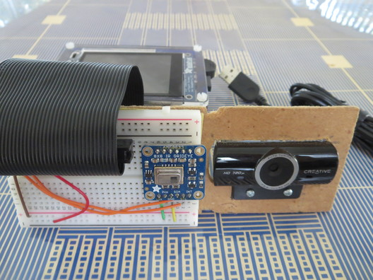
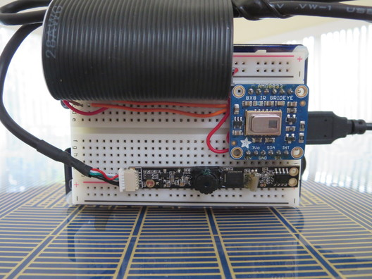
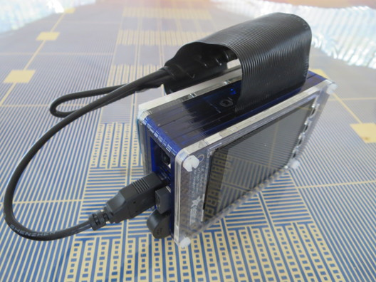
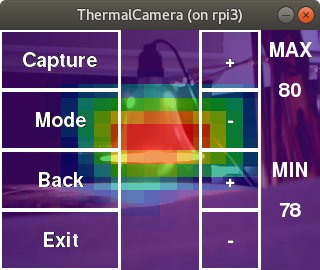
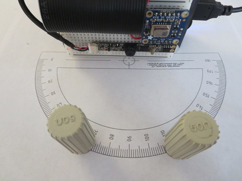
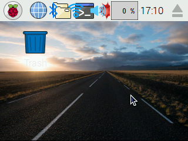
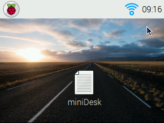

# ThermalCamera
Thermal Camera with Video Overlay for Raspberry Pi

## Hardware
- Raspberry Pi 3 (https://www.adafruit.com/product/3055)
- Adafruit AMG8833 IR Thermal Camera Breakout (https://www.adafruit.com/product/3538)
- USB Camera (https://publiclab.myshopify.com/collections/bits-bobs/products/webcam-dsk-3-0 , see below)
- Power supply, 5V 2.4A (https://www.adafruit.com/product/1995)

Optional:
- Adafruit PiTFT Plus 320x240 2.8" TFT + Capacitive Touchscreen (https://www.adafruit.com/product/2423)
- PiTFT Pibow+ Kit (https://www.adafruit.com/product/2779)
- Pi Cobbler (https://www.adafruit.com/product/2029)
  or
  - GPIO Ribbon Cable (https://www.adafruit.com/product/1988)
  - Extra-long Break-away 0.1" 16-pin male header (https://www.adafruit.com/product/400)
- Breadboard

### Wiring
The Thermal Camera connects using I2C:


### USB Camera
Just about any USB camera can be used.  Most webcams however, aren't designed for easy mounting.  For example, the Creative HD 720p:



The "Bare USB Webcam" from Public Lab ( https://publiclab.myshopify.com/collections/bits-bobs/products/webcam-dsk-3-0) works better: 



...and the complete assembly fits on the back of the PiTFT Pibow (https://www.adafruit.com/product/2779):




## Software

### Installation

```
cd /home/pi
git clone https://github.com/obstruse/ThermalCamera.git
sudo ThermalCamera/install/installThermalCamera.sh
```

### Execution

Run the program by clicking on the Desktop icon, or from the command line:
```
/home/pi/ThermalCamera/python/heat.py
```

Click on the window to bring up the menu overlay:



commands|&nbsp;
-|-
MAX/+/- | changes the maximum threshold for red pixels. 
MIN/+/- | changes the minimum threshold for blue pixels.
Capture | copy the current camra image to /home/pi/Pictures
Mode    | cycle through the display modes
Back    | return to display
Exit    | exit program


Display Modes:
- heat + camera overlay
- heat + edge detect overlay
- heat only (no scaling)
- camera only (no scaling)


### Calibration

To get the camera image to match the heat image, the Fields Of View must match.  Measure the camera FOV using the 'camera only' mode on heat.py (or use camera.py):



Enter the value at the top of ThermalCamera/python/heat.py:

```
camFOV = 35
```

I get approximately 35 degrees for the Bare USB Camera.

## Touchscreen

### Raspbian Image

For the capacitive touch 2.8" touchscreen, burn the "Easy Install" 'classic Jessie' image to an 8G SD card:

https://s3.amazonaws.com/adafruit-raspberry-pi/2016-10-18-pitft-28c.zip

For the resistive touchscreen (not tested), use:

https://s3.amazonaws.com/adafruit-raspberry-pi/2016-10-18-pitft-28r.zip

This is pre-configured with the touchscreen drivers required (ft6x06_ts) to work with pygame and SDL1.2

When this image boots, the PiTFT Desktop will look like this:



Unfortunately, the screen is too small to run the Preferences/Raspberry Pi Configuration; the icons at the top overlap so it's difficult to click on the WiFi icon to enable WiFi. Without WiFi you can't SSH to the Pi to install the program.

One solution is to mount the SD on your Desktop computer and copy the miniDesk script to /home/pi/Desktop:

https://raw.githubusercontent.com/obstruse/ThermalCamera/master/install/miniDesk

When the Pi boots, there will be a miniDesk icon on the Desktop.  Click it, logout and login, and you will have the simplified Desktop menus:



'Single-click' is also enabled: no need to double-click to execute an icon. Click the WiFi icon to enable and configure WiFi.

When ThermalCamera is installed, there will be a 'Heat' icon on the PiTFT Desktop.  Touch that to run the program

